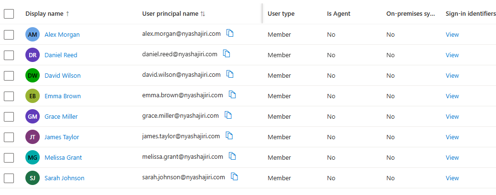
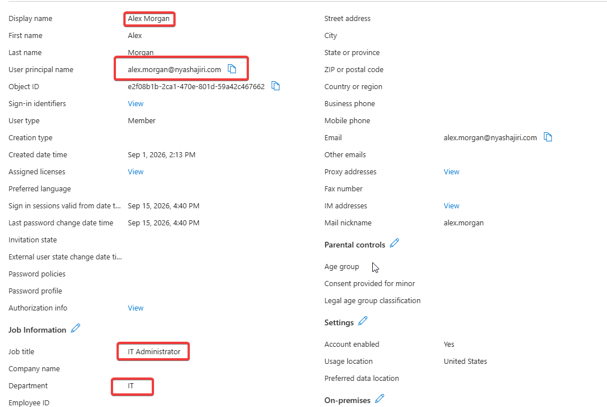
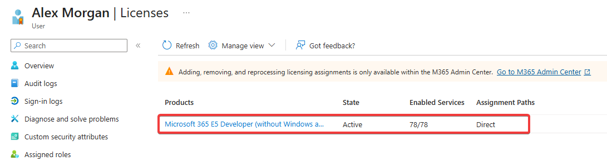

# Phase 1 — Identity and user provisioning

[Back to project overview](../README.md)

## Business requirement

For the Northstar Consulting lab scenario, the identity foundation supports employees accessing Microsoft 365 with individual organizational accounts. This phase establishes the user accounts used throughout the project, providing the foundation for later collaboration, access control, and security configurations.

## Implementation evidenced

The supplied Microsoft Entra user-list screenshot shows eight accounts using the `nyashajiri.com` domain and  user principal name (UPN) suffix. Each displayed account is a **Member**, with **On-premises sync: No**.

| Display name | User principal name |
| --- | --- |
| Alex Morgan | alex.morgan@nyashajiri.com |
| Daniel Reed | daniel.reed@nyashajiri.com |
| David Wilson | david.wilson@nyashajiri.com |
| Emma Brown | emma.brown@nyashajiri.com |
| Grace Miller | grace.miller@nyashajiri.com |
| James Taylor | james.taylor@nyashajiri.com |
| Melissa Grant | melissa.grant@nyashajiri.com |
| Sarah Johnson | sarah.johnson@nyashajiri.com |

### User profile and licensing example: Alex Morgan

The additional profile and licensing captures establish the following settings for Alex Morgan only:

| Setting | Observed value |
| --- | --- |
| Department | IT |
| Job title | IT Administrator |
| Account enabled | Yes |
| Usage location | United States |
| License | Microsoft 365 E5 Developer (product label is truncated in the capture) |
| License state | Active |
| Enabled services | 78/78 |
| Assignment path | Direct |

The job title is a profile attribute and the license screen shows the assignment state.

## Screenshots and evidence

*Figure 1. Supplied user-list capture: display names, UPNs, Member user type, and no on-premises synchronization for the eight displayed accounts.*

*Figure 2. Alex Morgan's profile shows the IT department, IT Administrator job title, enabled account, and United States usage location.*

*Figure 3. Alex Morgan's license displays Active, 78/78 enabled services, and Direct assignment.*

## Skills demonstrated

- **Identity administration:** maintaining a lab directory containing organizational Member accounts.
- **Account naming consistency:** using a consistent UPN pattern across the displayed accounts.
- **Directory inspection:** distinguishing user type and synchronization status when reviewing identities.
- **User profile administration:** documenting Alex Morgan's department, job title, account status, and usage location.
- **License review:** identifying Alex Morgan's active license, enabled services count, and direct assignment path.
