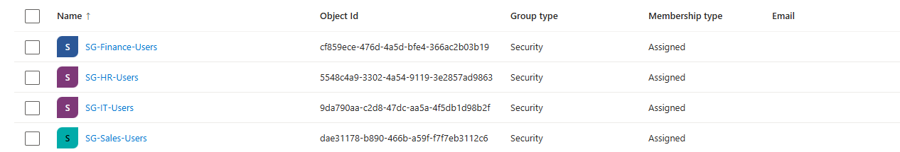
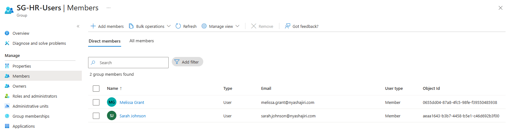
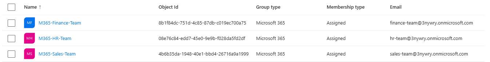
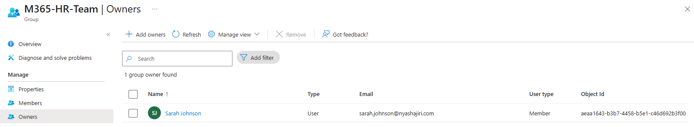
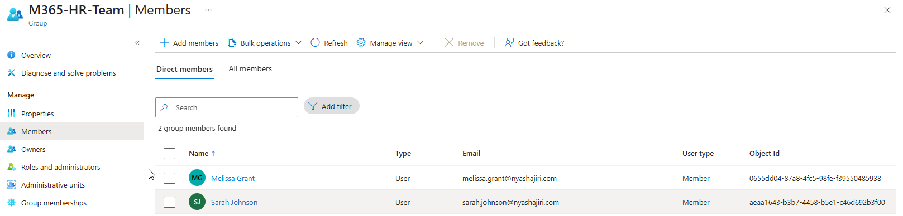

# Phase 2 — Security groups and Microsoft 365 groups

[Back to project overview](../README.md)

## Business requirement

Northstar Consulting required a department-based approach to access control and collaboration. IT, HR, Finance, and Sales needed security groups to organize access assignments. HR, Finance, and Sales also needed Microsoft 365 collaboration groups to support services such as Teams and SharePoint.

## Implementation evidenced

I created department-based security groups for IT, HR, Finance, and Sales, and Microsoft 365 collaboration groups for HR, Finance, and Sales. The screenshots below document their resulting configuration in Microsoft Entra.

### Security groups for access control

| Department | Group name | Group type | Membership type |
| --- | --- | --- | --- |
| IT | SG-IT-Users | Security | Assigned |
| HR | SG-HR-Users | Security | Assigned |
| Finance | SG-Finance-Users | Security | Assigned |
| Sales | SG-Sales-Users | Security | Assigned |

I used these security groups primarily for access control. The `SG-` prefix distinguishes them from the collaboration groups. All four show **Assigned** membership.

The HR example shows **Melissa Grant** and **Sarah Johnson** as the two direct members of `SG-HR-Users`. Membership lists for the other three security groups are not included in this phase's evidence.

### Microsoft 365 groups for collaboration

| Department | Group name | Group type | Membership type |
| --- | --- | --- | --- |
| HR | M365-HR-Team | Microsoft 365 | Assigned |
| Finance | M365-Finance-Team | Microsoft 365 | Assigned |
| Sales | M365-Sales-Team | Microsoft 365 | Assigned |

The `M365-` prefix identifies the collaboration groups. The group list displays an email address for each group.

For `M365-HR-Team`, the supplied Owners and Members views show:

| Relationship | Configuration |
| --- | --- |
| Owner | Sarah Johnson — one owner shown |
| Direct members | Melissa Grant and Sarah Johnson — two members shown |

Sarah appears explicitly in both the Owners and Members views. This documents ownership and participation separately. No Finance or Sales owner or member list has been supplied.

### Why use two group types?

| Group type | Primary purpose in this lab | Support relevance |
| --- | --- | --- |
| Security | Organize department users for access control | Review membership when investigating access to a resource assigned to the group |
| Microsoft 365 | Organize department collaboration | Review group membership and ownership when supporting shared workspaces |

Security groups can be granted permissions to resources. Microsoft 365 groups provide shared membership for collaboration resources such as SharePoint, and Teams uses Microsoft 365 groups for membership. Microsoft 365 group membership therefore also affects access to its connected resources.

A group name ending in `Team` does not establish that a Microsoft Teams team has been created. This phase documents the groups; Teams and SharePoint configuration are documented in [Phase 4](phase-04-microsoft-teams.md) and [Phase 5](phase-05-sharepoint-online.md).

The creation of these groups is confirmed by the lab author and their configuration is shown in the screenshots. The exact creation interface, click sequence, and order of operations have not been supplied.

## Screenshots and evidence

### Figure 1 — Department security groups

*IT, HR, Finance, and Sales security groups, with group type and membership type visible.*

### Figure 2 — HR security group members

*The Direct members view lists two users in SG-HR-Users.*

### Figure 3 — Microsoft 365 collaboration groups

*The three collaboration groups display Microsoft 365 as their group type and Assigned as their membership type.*

### Figure 4 — HR collaboration group owner

*The Owners view identifies Sarah Johnson as the group's single owner.*

### Figure 5 — HR collaboration group members

*The Direct members view lists Melissa Grant and Sarah Johnson, matching the HR security group's displayed membership.*

## Troubleshooting

No Phase 2 troubleshooting incident or resolution was supplied.

## Skills demonstrated

- **Group administration:** creating department-based Security and Microsoft 365 groups.
- **Group design:** distinguishing access-control groups from collaboration groups through purpose and consistent naming.
- **Membership administration:** configuring and reviewing the demonstrated HR memberships.
- **Ownership administration:** assigning and identifying Sarah Johnson as the HR collaboration group owner.
  
