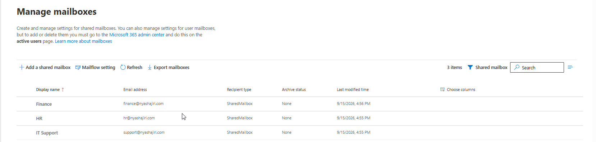
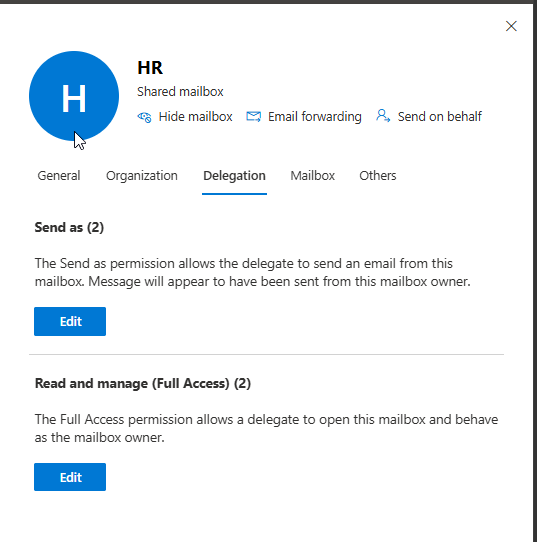
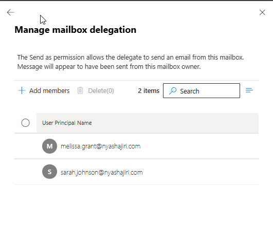
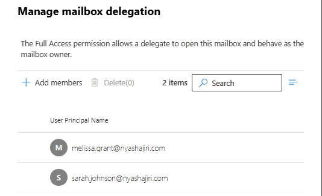
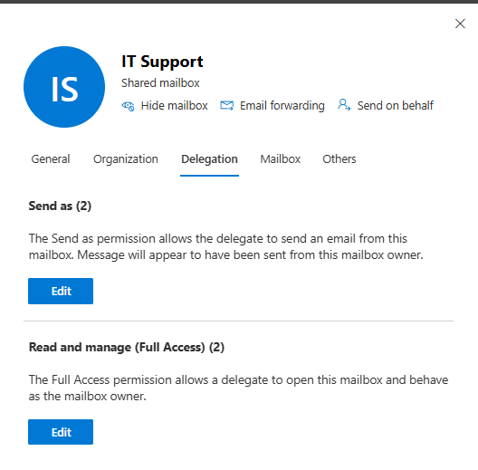
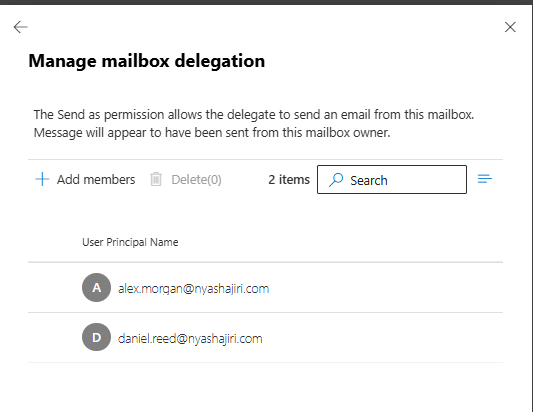
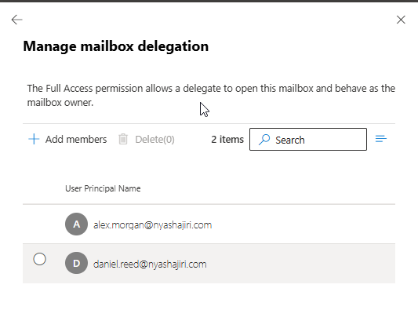
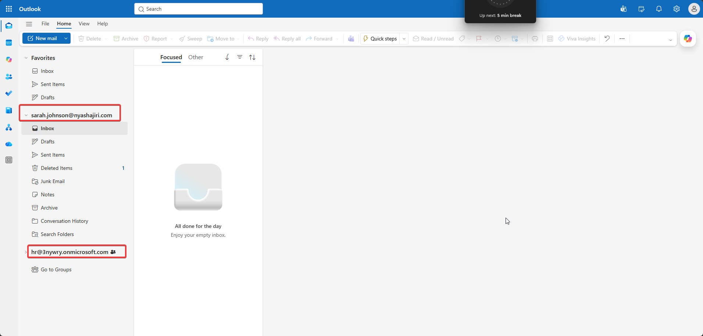
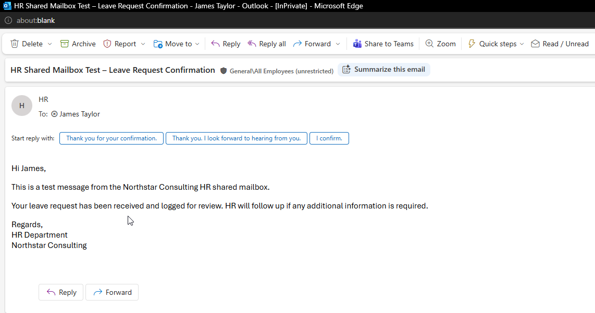

# Phase 3 — Exchange Online and shared mailboxes

[Back to project overview](../README.md)

## Business requirement

Northstar Consulting needed departmental mailboxes for HR, Finance, and IT Support so that communications could use a shared departmental identity. Designated users needed to manage mailbox content and send replies appearing to come from the department.

This phase documents the shared mailboxes, the evidenced delegation assignments for HR and IT Support, and the HR end-user validation.

## Implementation evidenced

### Departmental mailboxes

The Exchange admin center overview lists the following three objects with recipient type **SharedMailbox**:

| Display name | Email address displayed | Evidence |
| --- | --- | --- |
| HR | hr@nyashajiri.com | Figure 1 |
| Finance | finance@nyashajiri.com | Figure 1 |
| IT Support | support@nyashajiri.com | Figure 1 |

The overview confirms Finance's mailbox identity and type. Finance delegation and end-user tests were not supplied, so no Finance delegates or test outcomes are inferred.

### Full Access versus Send As

| Permission | What it allows | What it does not grant by itself |
| --- | --- | --- |
| Read and manage (Full Access) | Open the mailbox and view, add, or remove its contents | Permission to send messages as that mailbox |
| Send As | Send messages that appear to originate from the departmental mailbox | Permission to open or read the mailbox |

The permissions serve separate needs. A delegate who must manage mailbox contents and send as the department needs both. Send As presents the mailbox as the sender.

### Departmental delegation

The supplied Exchange admin center captures show separate **Send as** and **Read and manage (Full Access)** sections. Each HR and IT Support section lists two delegates. The corresponding Manage mailbox delegation views show these individual user assignments:

| Mailbox | Delegate | Full Access | Send As |
| --- | --- | --- | --- |
| HR | melissa.grant@nyashajiri.com | Assigned | Assigned |
| HR | sarah.johnson@nyashajiri.com | Assigned | Assigned |
| IT Support | alex.morgan@nyashajiri.com | Assigned | Assigned |
| IT Support | daniel.reed@nyashajiri.com | Assigned | Assigned |

The HR users were assigned both permissions to handle HR correspondence; the IT Support users were assigned both to handle support correspondence. 

## Validation and testing

### HR end-user validation

The supplied test evidence connects delegation configuration with the end-user experience:

1. **Delegate context:** Sarah Johnson's Outlook session displays her personal account and the HR shared mailbox in the navigation pane (Figure 8).
2. **Mailbox access:** The lab author reports the delegated user could open the mailbox. Figure 8 corroborates that it is listed in Sarah's Outlook; the HR entry is collapsed and Sarah's own Inbox is selected, so this frame does not directly show the HR Inbox contents.
3. **Departmental sending:** The received message in James Taylor's Outlook displays **HR** as the sender and **James Taylor** as the recipient (Figure 9).
4. **Test content:** The subject is **HR Shared Mailbox Test – Leave Request Confirmation**. The body identifies it as a test from the Northstar Consulting HR shared mailbox and uses an HR Department signature.

**Observed result:** The recipient-side capture supports successful delivery of the HR test message with the departmental display name. Together with the HR Send As assignments, it is consistent with the reported Send As validation. The received view does not reveal which delegate clicked Send or expose the full sender address or message headers.

### Validation record

| Check | Result supported by the supplied evidence | Evidence |
| --- | --- | --- |
| Shared mailboxes exist | HR, Finance, and IT Support listed as SharedMailbox | Figure 1 |
| HR delegation configured | Melissa Grant and Sarah Johnson listed for both permissions | Figures 2–4 |
| IT Support delegation configured | Alex Morgan and Daniel Reed listed for both permissions | Figures 5–7 |
| HR mailbox present in delegate's Outlook | HR entry visible alongside Sarah Johnson's account | Figure 8 |
| HR mailbox opened | Reported by the lab author; open contents not visible in the provided frame | Author's validation description and Figure 8 |
| Departmental sender displayed at recipient | James Taylor's received message shows HR as sender | Figure 9 |
| Finance delegation and mailbox tests | Not evidenced | No Finance-specific delegation or test capture supplied |
| IT Support end-user tests | Not evidenced | Configuration captures only |

Figure 8 labels the HR mailbox with an `onmicrosoft.com` address, while Figure 1 displays `hr@nyashajiri.com`. Both labels are preserved as supplied. These captures do not establish why the labels differ, or prove alias configuration, a client refresh fix, DNS changes, or external mail routing.

## Screenshots and evidence

### Figure 1 — Shared mailbox overview

*HR, Finance, and IT Support shown as SharedMailbox recipients with their displayed email addresses.*

### Figure 2 — HR delegation overview

*HR shows two Send As delegates and two Read and manage (Full Access) delegates.*

### Figure 3 — HR Send As delegates

*Melissa Grant and Sarah Johnson listed under the HR Send As permission.*

### Figure 4 — HR Full Access delegates

*Melissa Grant and Sarah Johnson listed under the HR Full Access permission.*

### Figure 5 — IT Support delegation overview

*IT Support shows two delegates in each permission section.*

### Figure 6 — IT Support Send As delegates

*Alex Morgan and Daniel Reed listed under the IT Support Send As permission.*

### Figure 7 — IT Support Full Access delegates

*Alex Morgan and Daniel Reed listed under the IT Support Full Access permission.*

### Figure 8 — HR mailbox in Sarah's Outlook

*Sarah Johnson's account and the collapsed HR shared mailbox entry are visible; Sarah's personal Inbox is selected.*

### Figure 9 — Received HR test message

*James Taylor's received message displays HR as the sender and the leave-request test subject.*

## Troubleshooting

No Phase 3 failure, diagnostic sequence, or corrective action was supplied. The difference between the HR address labels is recorded as an observation rather than a resolved incident.

## Skills demonstrated

- **Exchange Online administration:** documenting departmental shared mailbox identities and recipient types.
- **Mailbox delegation:** assigning and reviewing separate Full Access and Send As permissions for named users.
- **Permission reasoning:** distinguishing mailbox content access from the ability to send as a department.
- **End-user support:** validating the delegated Outlook experience and reviewing a received test message.
- **Evidence-based documentation:** connecting administrative configuration with user-visible results while identifying the limits of each capture.

These activities relate to common support requests involving departmental inbox access, shared mailbox permissions, and sending with a business identity.

**Review status:** Phase 3 approved. All eight phases are documented; final repository review is pending.
