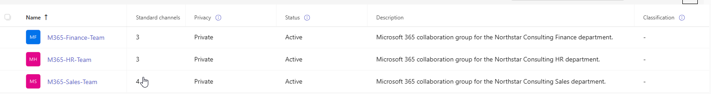
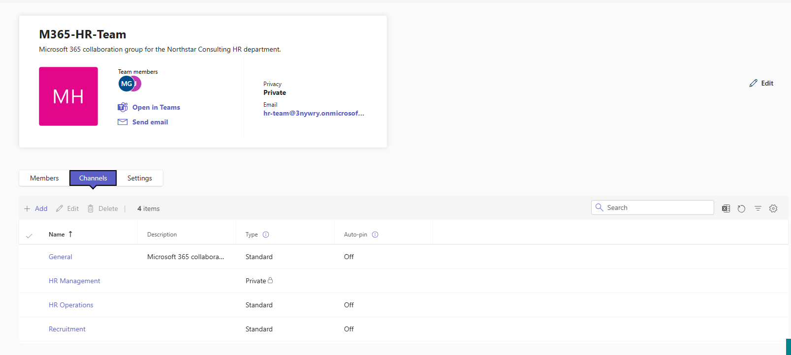
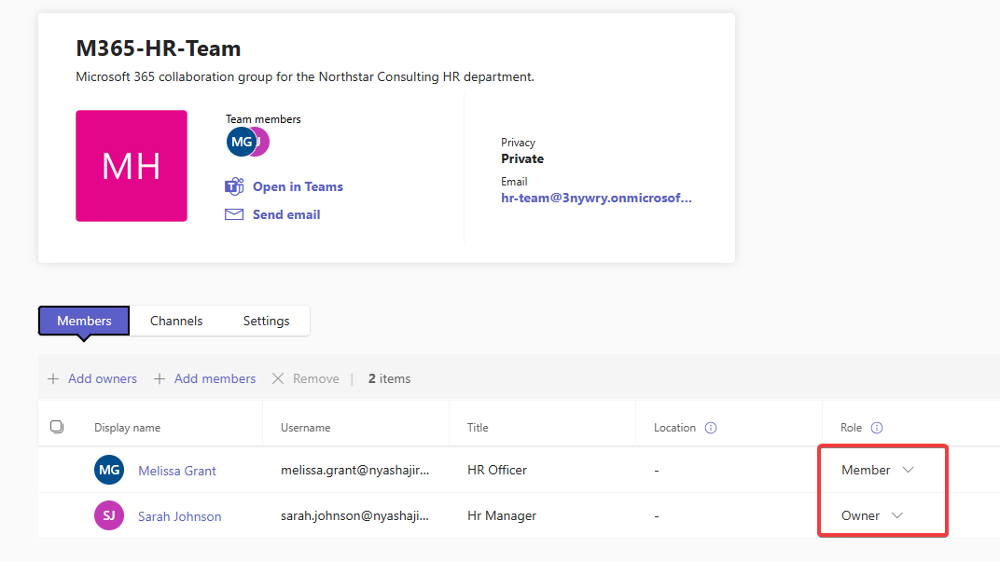
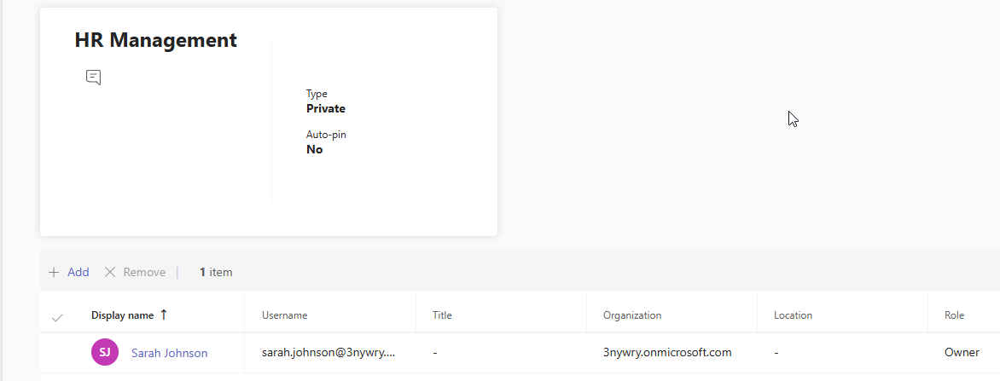
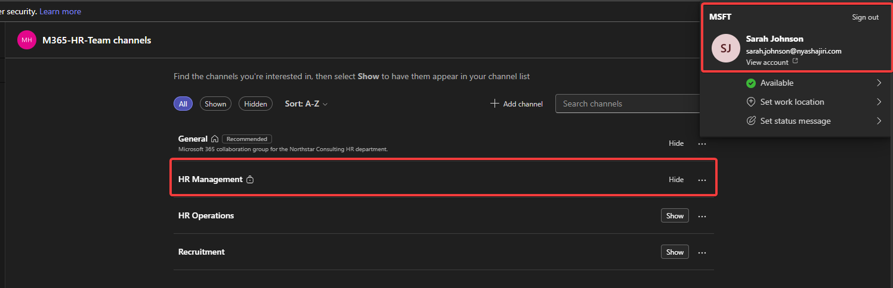
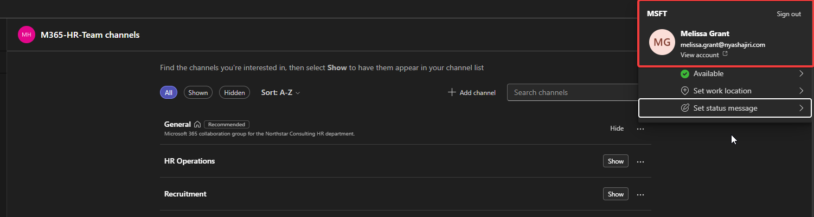

# Phase 4 — Microsoft Teams

[Back to project overview](../README.md)

## Business requirement

Northstar Consulting needed departmental collaboration spaces for HR, Finance, and Sales. Within HR, everyday work needed channels available to the team, while management discussions required a restricted space.

This phase documents the departmental teams, the evidenced HR channel structure and roles, and a two-user test of private-channel visibility.

## Implementation evidenced

### Departmental teams

The Teams administration overview shows three active teams with Private privacy:

| Team | Privacy | Status | Standard channels shown |
| --- | --- | --- | --- |
| M365-HR-Team | Private | Active | 3 |
| M365-Finance-Team | Private | Active | 3 |
| M365-Sales-Team | Private | Active | 4 |

### HR channel structure

The HR Channels view lists four channels:

| Channel | Type | Role in the lab's collaboration design |
| --- | --- | --- |
| General | Standard | General departmental collaboration |
| HR Operations | Standard | HR operational discussions |
| Recruitment | Standard | Recruitment-related collaboration |
| HR Management | Private | Restricted HR management collaboration |

### Team and private-channel membership

| User | Job title shown | HR team role | HR Management channel membership |
| --- | --- | --- | --- |
| Sarah Johnson | HR Manager | Owner | Owner — sole listed entry |
| Melissa Grant | HR Officer | Member | Not listed |

The HR team Members view contains two entries. The HR Management membership view contains one entry, Sarah Johnson, with role **Owner** and channel type **Private**. This establishes a narrower channel membership than the parent team's membership.

### Standard versus private channels

| Channel type | Participation scope | Application in this lab |
| --- | --- | --- |
| Standard | Available to the parent team's members | General, HR Operations, and Recruitment |
| Private | Restricted to team users added as private-channel owners or members | HR Management, with Sarah as its sole listed owner |

Team privacy and channel type are separate settings. HR is a **private team** that contains both **standard channels** and a **private channel**. Membership in the HR team alone does not give Melissa membership in HR Management. Microsoft documents that private channels restrict participation to their channel membership and that team members see only private channels they have been added to. [Microsoft Learn: Private channels in Microsoft Teams](https://learn.microsoft.com/en-us/microsoftteams/private-channels).

## Validation and testing

### Two-user access-control test

The test compares the same HR team's **All** channels view under two identified accounts. The account menus make the active user visible in each capture.

| Test user | Expected visibility from the recorded membership | Observed result | Outcome |
| --- | --- | --- | --- |
| Sarah Johnson — sarah.johnson@nyashajiri.com | HR Management listed because Sarah is its owner | General, HR Management with a lock icon, HR Operations, and Recruitment are listed | Matches expected visibility |
| Melissa Grant — melissa.grant@nyashajiri.com | Standard channels listed; HR Management absent because Melissa is not in its membership | General, HR Operations, and Recruitment are listed; HR Management is absent | Matches expected restriction |

**Result:** The recorded membership and the contrasting user views support the private-channel visibility restriction. Sarah sees HR Management, while Melissa remains a member of the HR team and sees its standard channels without seeing HR Management.

Both screenshots use **All**, rather than only the Shown or Hidden view. The Show/Hide controls relate to channel-list presentation; they should not be interpreted as granting or removing membership.

**Test scope:** These captures demonstrate channel visibility under the two accounts. They do not show opening private-channel conversations, accessing files, or a direct-link attempt returning an access-denied error. The filename of Figure 6 describes the negative validation, but the observed result is the private channel's absence from Melissa's channel list.

### Configuration checks

| Check | Evidence-supported result | Evidence |
| --- | --- | --- |
| Departmental teams present | HR, Finance, and Sales are Active and Private | Figure 1 |
| HR channel types | Three Standard channels and one Private channel | Figure 2 |
| HR team roles | Sarah is Owner; Melissa is Member | Figure 3 |
| Private-channel membership | Sarah is the single listed owner | Figure 4 |
| Authorized-user visibility | Sarah's All view includes HR Management | Figure 5 |
| Nonmember visibility | Melissa's All view excludes HR Management | Figure 6 |

## Screenshots and evidence

### Figure 1 — Departmental teams overview

*Three active, private departmental teams; standard channel counts are HR 3, Finance 3, and Sales 4.*

### Figure 2 — HR channel structure

*General, HR Operations, and Recruitment are Standard; HR Management is Private.*

### Figure 3 — HR team membership and roles

*Melissa Grant is an HR Officer and team Member; Sarah Johnson is an HR Manager and team Owner.*

### Figure 4 — HR Management private-channel membership

*The private-channel membership view contains one entry: Sarah Johnson with the Owner role.*

### Figure 5 — Authorized-user visibility: Sarah

*Sarah's identity is visible, All is selected, and HR Management appears with a lock icon alongside the three standard channels.*

### Figure 6 — Nonmember visibility: Melissa

*Melissa's identity is visible and All is selected. The three standard channels appear; HR Management does not.*

## Troubleshooting

No Phase 4 fault, corrective change, or retest after a fix was supplied. Melissa's missing private channel is the expected result of the recorded membership, rather than evidence of a Teams fault.

## Skills demonstrated

- **Teams administration:** organizing departmental collaboration and reviewing team privacy and status.
- **Channel design:** separating standard departmental channels from restricted management collaboration.
- **Membership and role administration:** distinguishing team Owner and Member roles from private-channel membership.
- **Access-control validation:** comparing authorized and nonmember user views against the configured membership.
- **End-user support:** interpreting channel visibility in the context of account identity, membership, and list filters.
- **Technical documentation:** linking the business requirement, configuration, and observed test results without extending claims beyond the evidence.

These skills relate to common support requests involving missing Teams channels, departmental onboarding, team ownership, and access to restricted collaboration spaces.

**Review status:** Phase 4 approved. All eight phases are documented; final repository review is pending.
