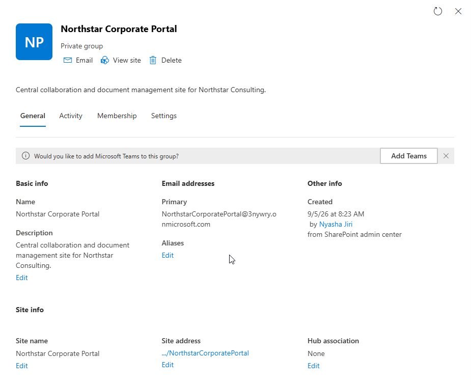
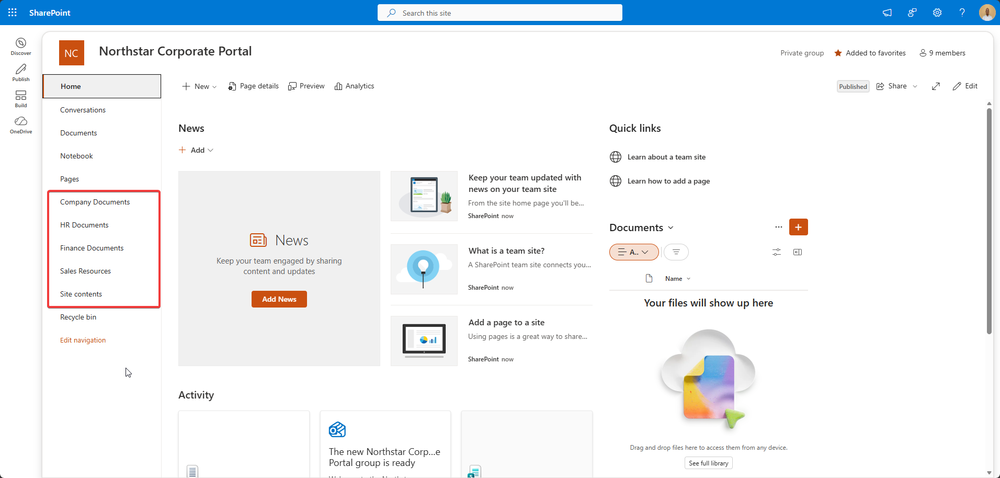
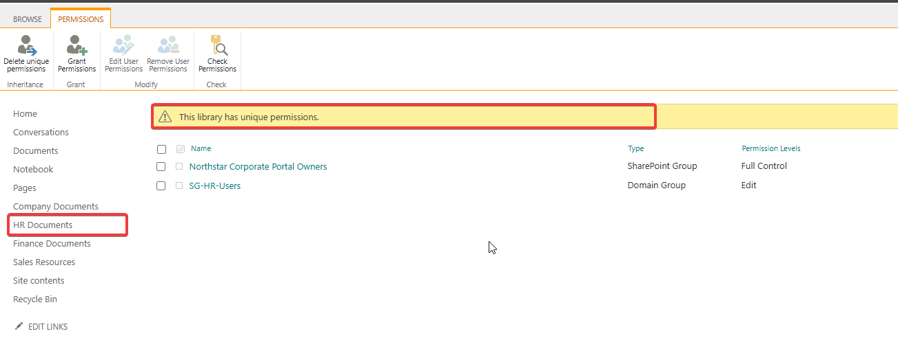
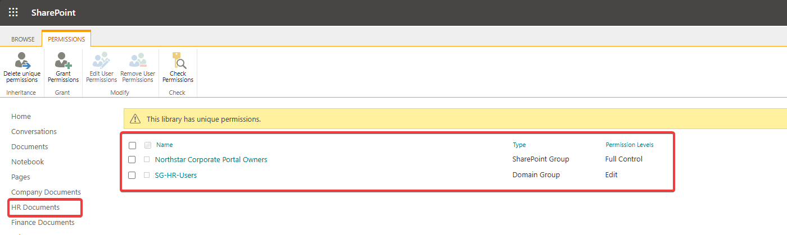
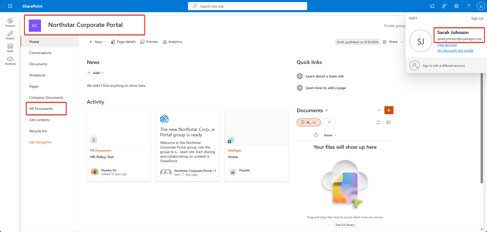
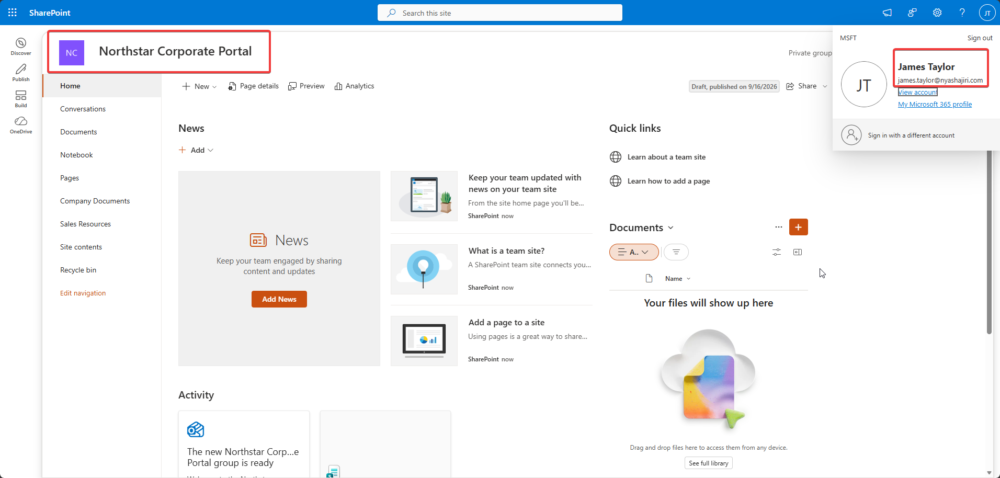

# Phase 5 — SharePoint Online

[Back to project overview](../README.md)

## Business requirement

Northstar Consulting needed a central portal for company documents alongside department-restricted document libraries. Employees needed access appropriate to their department, with administrative control retained by the portal owners.

The design uses security-group assignments to manage departmental access without adding each employee separately to a library's permissions.

## Implementation evidenced

### Northstar Corporate Portal

The supplied administration capture identifies **Northstar Corporate Portal** as a private group with an associated SharePoint site. Its description is “Central collaboration and document management site for Northstar Consulting.” The portal home page provides navigation to the document libraries.

### Document library structure

| Library | Purpose in the stated lab design ||
| --- | --- | --- |
| HR Documents | Department-restricted HR documentation | 
| Finance Documents | Department-restricted Finance documentation | 
| Sales Resources | Department-restricted Sales resources |

### Permission inheritance and departmental restriction

Permission inheritance means a library uses permissions from its parent site. Stopping inheritance gives the library a separately managed permission scope, allowing its access assignments to differ from the site's. This is useful when users need portal access without access to every departmental library. Stopping inheritance alone is not proof of restricted access: the resulting permission entries must also be reviewed and adjusted to meet your needs.
In this lab, inheritance was stopped for the HR, Finance, and Sales libraries to support departmental restrictions. The HR permissions page confirms the resulting state with **This library has unique permissions** and these entries:

| Principal | Type displayed | Permission level |
| --- | --- | --- |
| Northstar Corporate Portal Owners | SharePoint Group | Full Control |
| SG-HR-Users | Domain Group | Edit |

The portal owners retain administrative control while SG-HR-Users supplies the departmental permission assignment. 
### Entra security groups instead of individual assignments

The documented design uses Entra department security groups for library permissions. HR demonstrates this directly: **SG-HR-Users** is assigned **Edit**, rather than Sarah or Melissa being individually listed on this library permission page. SharePoint displays the security-group principal as **Domain Group**.

The [Phase 2 evidence](phase-02-security-and-microsoft-365-groups.md) lists Sarah Johnson and Melissa Grant as direct members of SG-HR-Users. This provides a documented connection between department membership and the HR library assignment.Using a group allows departmental membership to be managed centrally while keeping the library permission entry in place.

## Validation and testing

### HR user comparison

The supplied captures show the portal home page under two identified accounts:

| User | Visible result | What the capture establishes |
| --- | --- | --- |
| Sarah Johnson | HR Documents appears in navigation; an HR-Policy-Test activity card is visible | Sarah can load the portal and sees HR-related navigation and activity |
| James Taylor | Company Documents and Sales Resources appear; HR Documents is absent | James can load the portal but does not see the HR navigation entry in this view |

The user describes the validation as authorized HR access and unrelated-user exclusion. The observed views are consistent with that intended restriction, and HR's group-based unique permissions provide configuration evidence.

## Screenshots and evidence

### Figure 1 — Northstar Corporate Portal

*Portal identity, description, private group, and associated site information.*

### Figure 2 — Document libraries overview

*Company Documents, HR Documents, Finance Documents, and Sales Resources appear in portal navigation.*

### Figure 3 — HR unique permissions

*The HR library displays the unique-permissions banner.*

### Figure 4 — HR security-group access

*Northstar Corporate Portal Owners has Full Control; SG-HR-Users has Edit.*

### Figure 5 — Sarah's portal view

*Sarah's identified session shows HR Documents in navigation and the HR-Policy-Test activity card.*

### Figure 6 — James's portal view

*James's identified session shows the portal home page without the HR Documents navigation entry.*

## Skills demonstrated

- **SharePoint organization:** structuring a corporate portal with company and departmental document libraries.
- **Permission administration:** reviewing a library's unique permission scope and its assigned principals.
- **Group-based access management:** using SG-HR-Users for departmental Edit access while retaining portal-owner Full Control.
- **Permission reasoning:** separating site access, library permissions, and navigation visibility.
- **End-user validation:** comparing identified user sessions with the intended departmental access model.
- **Technical documentation:** distinguishing screenshot-verified configuration, author-described implementation, and tests not directly captured.

These skills support common service-desk requests involving document access, department onboarding, missing navigation entries, and permission reviews.

**Review status:** Phase 5 approved. All eight phases are documented; final repository review is pending.
