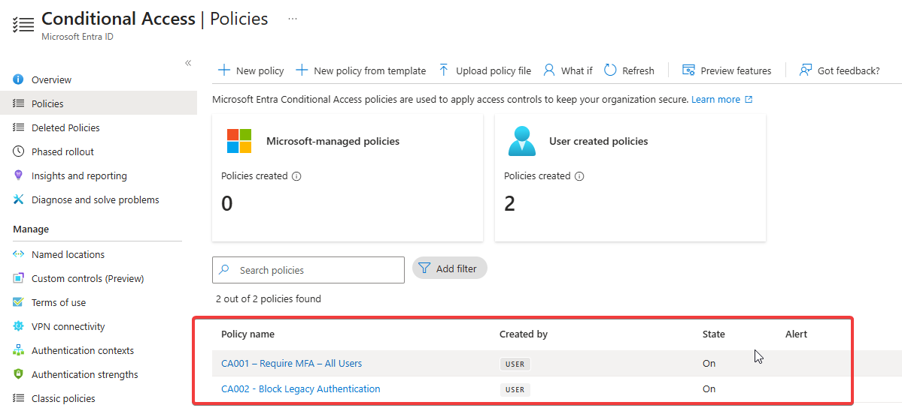
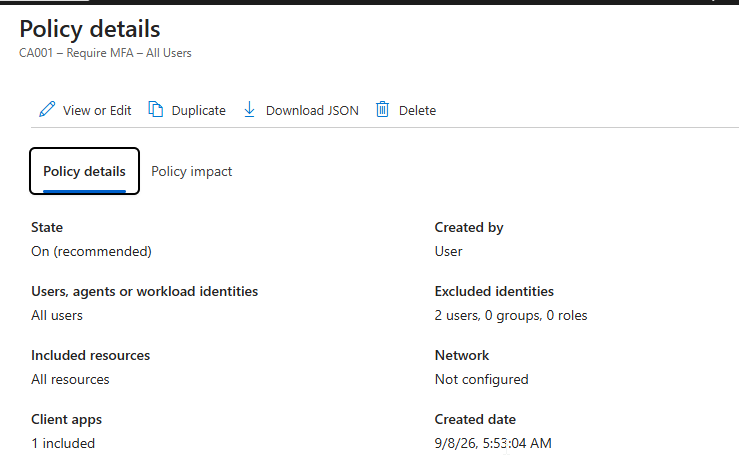
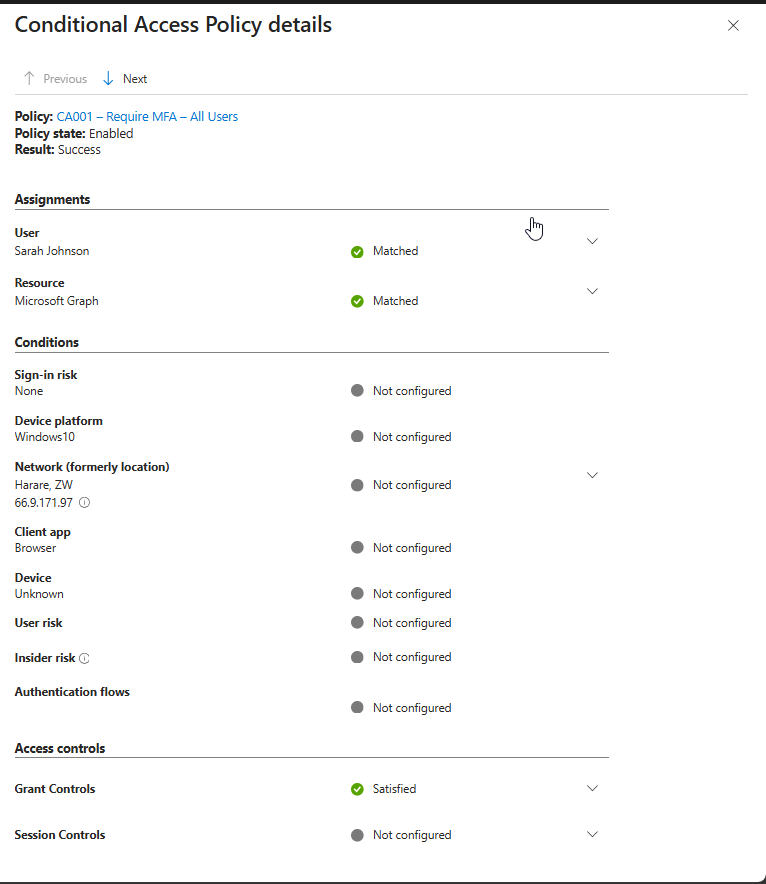
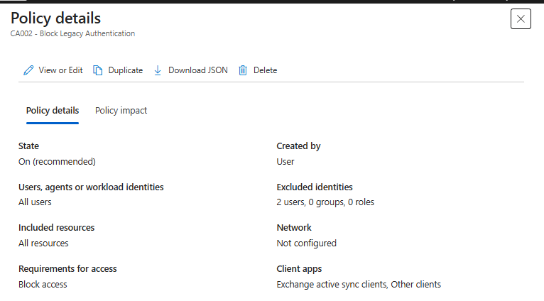
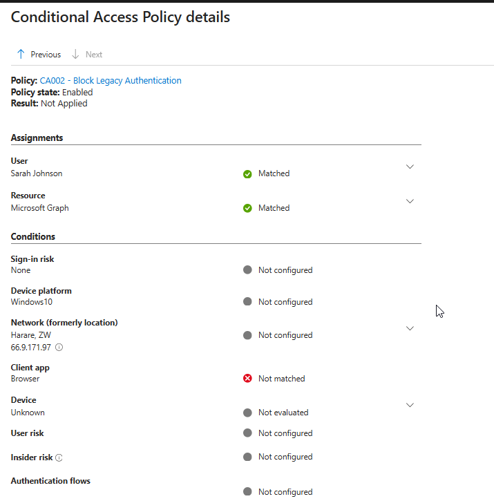

# Phase 6 — MFA and Conditional Access

[Back to project overview](../README.md)

## Business requirement

Northstar Consulting needed stronger sign-in protection through multifactor authentication (MFA) and a policy blocking legacy authentication. The deployment also needed an emergency access exception and a testing stage before enforcement to reduce unintended access disruption.

This phase documents CA001 and CA002, the reported Report-only rollout, and the supplied enabled-policy evaluations in Microsoft Entra sign-in logs.

## Implementation evidenced

### Policy overview

The Conditional Access policy list shows two user-created policies, both **On**:

| Policy | Purpose | Current state |
| --- | --- | --- |
| CA001 – Require MFA – All Users | Require MFA for included users | On |
| CA002 - Block Legacy Authentication | Block the configured legacy client-app categories | On |

### CA001 — Require MFA

The lab author confirms that CA001 requires MFA for all users while excluding the emergency access account. Its supplied summary shows:

| Setting | Displayed configuration |
| --- | --- |
| Included identities | All users |
| Included resources | All resources |
| Excluded identities | 2 users, 0 groups, 0 roles |
| State | On |
| Network | Not configured |
| Client apps | 1 included; category not expanded |

**Exclusion scope:** The emergency-account exclusion is confirmed by the author. The summary shows **two** excluded users, without their names. The second identity is not provided, and the emergency account's username is not invented. The document therefore does not describe the emergency account as the only exclusion.

The MFA requirement is supplied by the author and reflected in the policy name. The summary does not expose the detailed grant selection or an authentication strength, so no specific method or strength is asserted.

### CA002 — Block legacy authentication

| Setting | Displayed configuration |
| --- | --- |
| Included identities | All users |
| Included resources | All resources |
| Excluded identities | 2 users, 0 groups, 0 roles |
| Requirements for access | Block access |
| Client apps | Exchange active sync clients; Other clients |
| State | On |
| Network | Not configured |

These configured client-app categories define the legacy-authentication policy's scope in the supplied summary. CA002 also has two excluded users, but their identities are not shown. No assumption is made that they are the same exclusions as CA001.

### Report-only testing before enforcement

I first tested both policies in **Report-only** mode, reviewed their behavior in **Microsoft Entra sign-in logs**, and then enabled them after confirming the expected behavior.

This sequence is the lab author's reported implementation history. The five supplied screenshots capture the later **On/Enabled** state; they do not include the earlier Report-only results or a policy-change audit trail. Exact Report-only outcomes, test dates, and additional test accounts are not inferred.

Report-only mode evaluates a policy and records its results without enforcing its access controls. This allows administrators to review policy impact before switching to On. Enabled-policy Success indicates that the policy applied and its requirements were met; it does not establish whether other policies also allowed the sign-in. [Microsoft Learn: Analyze Conditional Access policy impact](https://learn.microsoft.com/en-us/entra/identity/conditional-access/concept-conditional-access-report-only).

## Validation and testing

### CA001 — Successful application

The CA001 policy evaluation shows:

| Evaluation field | Observed result |
| --- | --- |
| Policy state | Enabled |
| Policy result | Success |
| User | Sarah Johnson — Matched |
| Resource | Microsoft Graph — Matched |
| Client app | Browser; condition displayed as Not configured |
| Grant controls | Satisfied |
| Session controls | Not configured |

**Result:** CA001 applied successfully to the captured evaluation and its grant controls were satisfied. This supports the stated MFA policy's successful evaluation for Sarah. It does not identify the authentication method, show an MFA prompt, or prove that Sarah completed a new MFA challenge during this particular sign-in.

The policy summary displays Client apps as “1 included,” while the sign-in evaluation displays the client-app condition as “Not configured.” Both are recorded as supplied. These screenshots do not establish whether configuration changed between the captures.

### CA002 — Correctly not applied to the browser sign-in

The CA002 evaluation shows:

| Evaluation field | Observed result |
| --- | --- |
| Policy state | Enabled |
| Policy result | Not Applied |
| User | Sarah Johnson — Matched |
| Resource | Microsoft Graph — Matched |
| Client app | Browser — Not matched |
| Device | Unknown — Not evaluated |

**Result:** The user and resource matched, but the Browser client did not match CA002's configured client-app condition. The policy therefore did not apply to the normal modern-browser sign-in described by the author. This is the expected scope behavior for this test, not evidence that CA002 was disabled or malfunctioning.

The screenshots do not show a legacy-client attempt being blocked. They also do not expose event identifiers that independently establish that both policy panels came from the exact same sign-in event.

### Validation summary

| Check | Evidence-supported conclusion | Evidence |
| --- | --- | --- |
| Both policies enabled | Policy list shows On for CA001 and CA002 | Figure 1 |
| CA001 assignments | All users and all resources included, with two user exclusions | Figure 2 |
| Emergency-access exception | Reported by the author; excluded username not displayed | Author's configuration description |
| Report-only rollout | Both policies tested and reviewed before enabling, as reported by the author | Author's implementation description |
| CA001 application | Success with grant controls Satisfied for Sarah and Microsoft Graph | Figure 3 |
| CA002 configuration | Block access with the two displayed legacy client-app categories | Figure 4 |
| Modern-browser scope test | Not Applied because Browser did not match | Figure 5 |
| Actual legacy-authentication block | Not demonstrated in the supplied captures | No blocked legacy-client test supplied |

## Screenshots and evidence

### Figure 1 — Enabled Conditional Access policies

*Two user-created policies, CA001 and CA002, both show On.*

### Figure 2 — CA001 policy summary

*CA001 includes all users and all resources, with two unnamed excluded users.*

### Figure 3 — CA001 sign-in evaluation

*Sarah and Microsoft Graph match; CA001 is Enabled, its result is Success, and grant controls are Satisfied.*

### Figure 4 — CA002 legacy-authentication policy

*CA002 shows Block access, Exchange active sync clients and Other clients, and two unnamed excluded users.*

### Figure 5 — CA002 browser sign-in evaluation

*The Browser client is Not matched, resulting in Not Applied for the enabled CA002 policy.*

## Troubleshooting and interpretation

The CA002 Not Applied result is explained by the recorded client-app mismatch. The policy's enabled state, matching user and resource, and nonmatching client condition distinguish expected policy scope from a failed deployment.

No corrective policy change or failure-and-retest sequence was supplied for this phase. No additional incident resolution is claimed.

## Skills demonstrated

- **Conditional Access administration:** configuring an MFA policy and a legacy-authentication blocking policy.
- **Deployment planning:** testing in Report-only mode before enforcement, as described by the lab author.
- **Exception awareness:** accounting for the reported emergency-access exclusion while documenting the actual exclusion counts.
- **Sign-in log analysis:** reading assignment matches, client-app conditions, grant controls, and per-policy results.
- **Support troubleshooting:** distinguishing successful enforcement from a policy correctly not applying to a particular client.
- **Technical documentation:** separating observed policy state and evaluations from rollout history and unprovided authentication details.

These skills support entry-level investigations of MFA requirements, sign-in behavior, and Conditional Access policy scope.

**Review status:** Phase 6 approved. All eight phases are documented; final repository review is pending.
