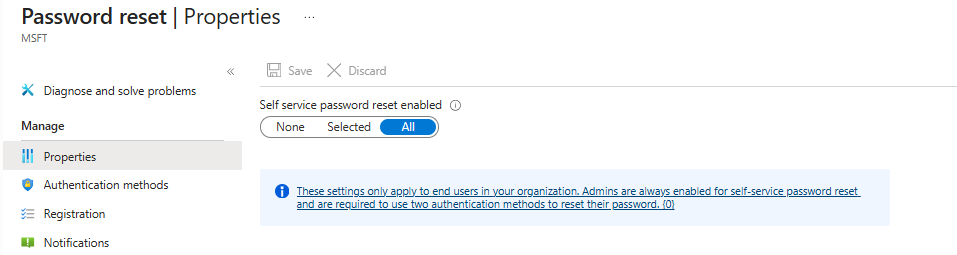
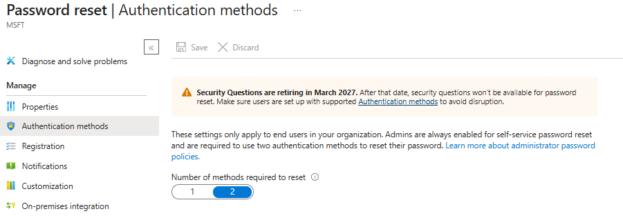
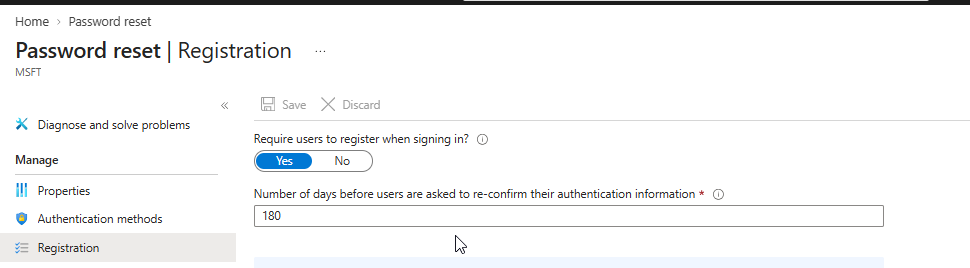
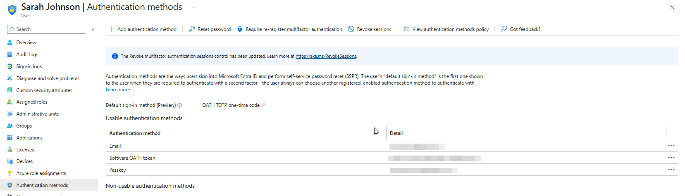
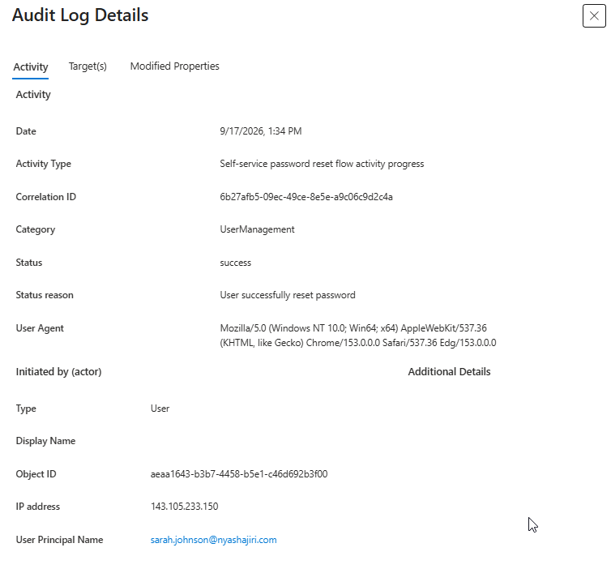

# Phase 7 — Self-Service Password Reset

[Back to project overview](../README.md)

## Business requirement

Northstar Consulting needed users to recover access through Self-Service Password Reset (SSPR), reducing dependence on administrator-assisted resets. Users needed to register authentication information in advance and meet the required verification count before resetting a password.

This phase documents tenant-wide SSPR settings, the reported registration mismatch, and successful reset evidence from both the user experience and Microsoft Entra audit logs.

## Implementation evidenced

### SSPR scope and registration

| Setting | Observed configuration | Evidence |
| --- | --- | --- |
| Self-service password reset enabled | All | Figure 1 |
| Number of methods required to reset | 2 | Figure 2 |
| Require users to register when signing in | Yes | Figure 3 |
| Reconfirm authentication information | Every 180 days | Figure 3 |

The All selection enables SSPR for the tenant's end-user population, including the Northstar lab users. Registration at sign-in prompts users to prepare authentication information. The 180-day value is a reconfirmation interval, not a password-expiration period.

SSPR checks that a user has sufficient registered methods permitted by the applicable policy. A two-method requirement cannot be met with only one eligible method. Registration settings and the user's registered information therefore need to be considered together.
### Sarah Johnson's recorded authentication methods

The supplied user Authentication methods view shows:

| Field | Visible value |
| --- | --- |
| Default sign-in method (Preview) | OATH TOTP one-time code |
| Listed method | Email |
| Listed method | Software OATH token |
| Listed method | Passkey |

### Microsoft Entra audit evidence

The supplied Audit Log Details capture provides account-specific confirmation:

| Audit field | Displayed value |
| --- | --- |
| Date | September 17, 2026, 1:34 PM — as displayed; timezone not shown |
| Activity Type | Self-service password reset flow activity progress |
| Category | UserManagement |
| Status | success |
| Status reason | User successfully reset password |
| Initiated by — Type | User |
| User Principal Name | sarah.johnson@nyashajiri.com |

The audit event directly supports a successful self-service password reset for Sarah. The status reason is more specific than the general activity name: it explicitly records that the password was reset. 

### Validation record

| Check | Result supported by the evidence | Evidence |
| --- | --- | --- |
| SSPR scope | All selected | Figure 1 |
| Reset requirement | Two methods selected | Figure 2 |
| Sign-in registration | Required; 180-day reconfirmation | Figure 3 |
| User registration inventory | Email, Software OATH token, and Passkey listed for Sarah | Figure 4 |
| Account-specific reset outcome | Audit status success; reason confirms successful password reset for Sarah | Figure 5 |
| Reset completion screen | Your password has been reset | Figure 6 |
| Sign-in with the new password | Not captured | No post-reset sign-in evidence supplied |

## Screenshots and evidence

### Figure 1 — SSPR properties

*Self-service password reset is enabled for All.*

### Figure 2 — Authentication-method requirement

*The number of methods required to reset is set to 2.*

### Figure 3 — Sign-in registration policy

*Registration at sign-in is set to Yes, with authentication-information reconfirmation after 180 days.*

### Figure 4 — Sarah's authentication-method inventory

*Email, Software OATH token, and Passkey are listed; sensitive method details remain obscured as supplied.*

### Figure 5 — Successful SSPR audit event

*Microsoft Entra records success and User successfully reset password for Sarah's user principal name.*

### Figure 6 — User-facing reset confirmation

*The completed flow displays Your password has been reset.*

## Skills demonstrated

- **Identity recovery configuration:** reviewing SSPR scope and authentication-method count requirements.
- **Registration administration:** requiring sign-in registration and configuring periodic reconfirmation.
- **Authentication-method review:** inspecting a user's registered methods without disclosing their sensitive details.
- **Troubleshooting:** identifying a mismatch between required methods and initial registration readiness.
- **Audit analysis:** interpreting the activity type, actor, status, and status reason to verify a reset.

