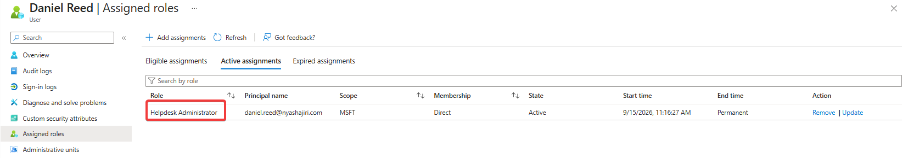
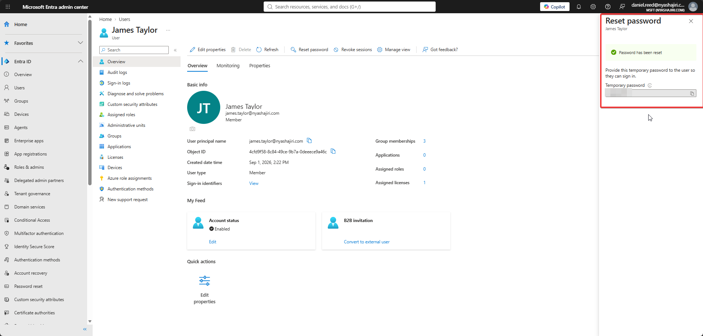
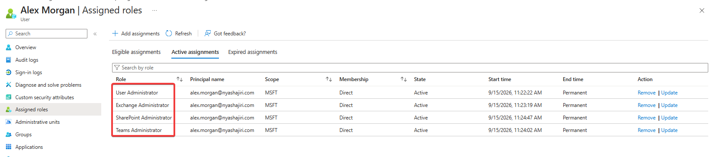
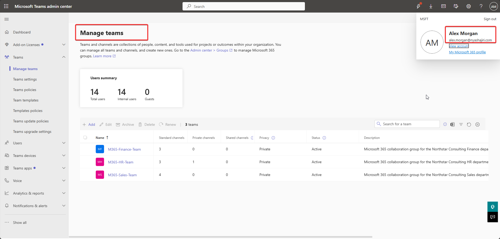
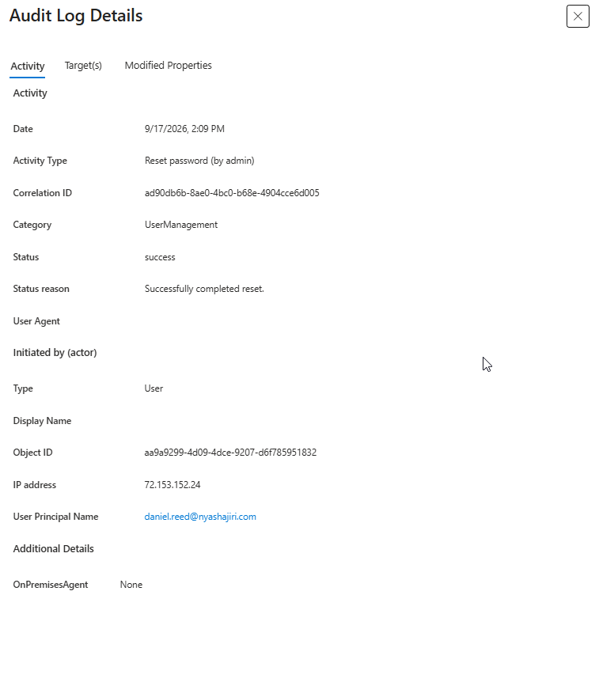
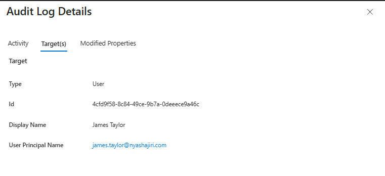
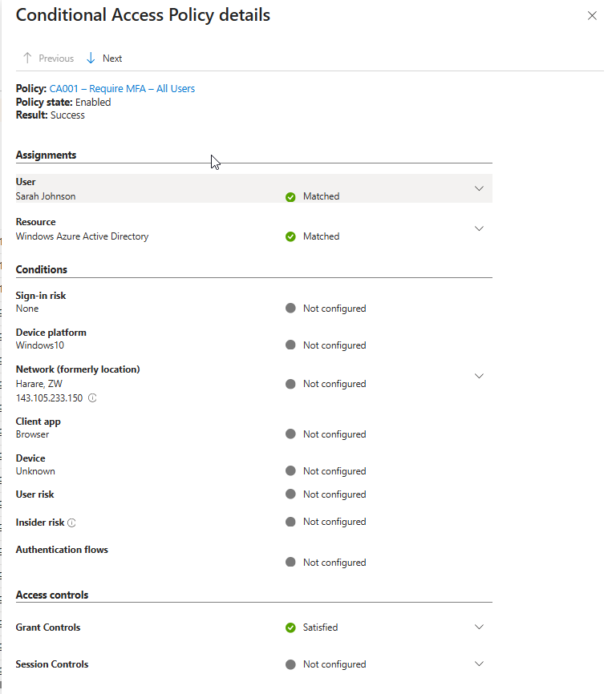
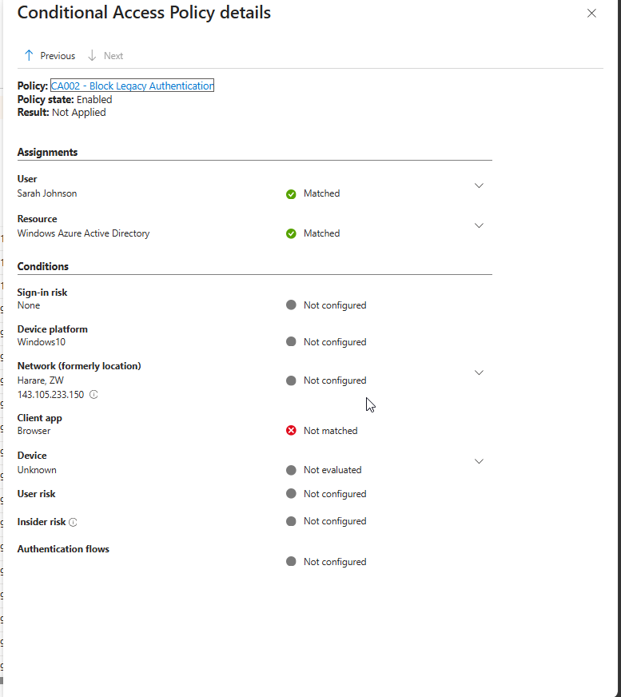

# Phase 8 — RBAC, Administrative Delegation, and Auditing

[Back to project overview](../README.md)

## Business requirement

Northstar Consulting needed to delegate routine support and workload administration without giving every administrator Global Administrator access. Support staff needed enough authority to resolve appropriate user issues, while administrators needed access aligned with their assigned services. Administrative actions and sign-in policy evaluations also needed to be traceable.

This phase documents supplied role assignments, Daniel Reed's password-reset validation, Alex Morgan's Teams admin access, and Microsoft Entra audit and Conditional Access evidence.

## Implementation evidenced

### Role-based delegation

Role-based access control (RBAC) assigns administrative capabilities through defined roles. Least privilege means limiting those capabilities to the responsibilities a person needs to perform. In this lab, Daniel received a support role, while Alex received four roles aligned with user and workload administration instead of Global Administrator.

| Administrator | Evidenced role assignment | Intended responsibility |
| --- | --- | --- |
| Daniel Reed — daniel.reed@nyashajiri.com | Helpdesk Administrator | Limited support tasks, demonstrated here by resetting an eligible user's password |
| Alex Morgan — alex.morgan@nyashajiri.com | User Administrator | User administration |
| Alex Morgan | Exchange Administrator | Exchange administration |
| Alex Morgan | Teams Administrator | Teams administration |
| Alex Morgan | SharePoint Administrator | SharePoint administration |

Using these roles reduced unnecessary administrative exposure by matching delegated access to support and service responsibilities rather than granting broad tenant administration.

## Validation and testing

| Validation | Supplied evidence | Observed result |
| --- | --- | --- |
| Daniel's delegated role | Figure 1 | Helpdesk Administrator is directly assigned and active |
| Helpdesk password reset | Figure 2 | Daniel's session shows James Taylor's profile and the confirmation **Password has been reset** |
| Alex's role configuration | Figure 3 | User, Exchange, SharePoint, and Teams Administrator are active |
| Alex's workload access | Figure 4 | Alex is signed in to the Teams admin center and can view **Manage teams** |
| Administrative audit trail | Figures 5a–5b | Successful **Reset password (by admin)** event identifies Daniel as actor and James as target |
| CA001 evaluation | Figure 6a | Enabled policy returns **Success**, with user/resource matched and grant controls satisfied |
| CA002 evaluation | Figure 6b | Enabled policy returns **Not Applied**; the Browser client does not match its client-app condition |

### Helpdesk action and audit correlation

Figure 2 shows James Taylor (james.taylor@nyashajiri.com) with **0 assigned roles**, and the successful reset confirmation in Daniel's signed-in session.

The paired audit views record:

| Audit field | Visible value |
| --- | --- |
| Date | September 17, 2026, 2:09 PM; timezone not shown |
| Activity type | Reset password (by admin) |
| Category | UserManagement |
| Status | success |
| Status reason | Successfully completed reset. |
| Initiating user | daniel.reed@nyashajiri.com |
| Target | James Taylor — james.taylor@nyashajiri.com |

Together, the interface confirmation and audit details support the successful delegated reset.

### Workload access

Figure 4 identifies Alex Morgan in the Teams admin center and displays the Finance, HR, and Sales teams under **Manage teams**. This validates access to the Teams administration view. 

### Authentication and Conditional Access evidence

Figures 6a and 6b concern **Sarah Johnson**, with **Windows Azure Active Directory** as the matched resource and **Browser** as the client app.

- **CA001 – Require MFA – All Users:** policy state **Enabled**, result **Success**, and **Grant Controls: Satisfied**.
- **CA002 – Block Legacy Authentication:** policy state **Enabled**, result **Not Applied**, and Browser **Not matched** under Client app.

CA002's result is consistent with the normal browser sign-in falling outside the policy's targeted client-app condition.

## Screenshots and evidence

### Figure 1 — Daniel's delegated role

*Direct, active Helpdesk Administrator assignment with a Permanent end time.*

### Figure 2 — Helpdesk password-reset validation

*The reset confirmation is visible; the supplied image obscures the temporary password.*

### Figure 3 — Alex's administrator roles

*User, Exchange, SharePoint, and Teams Administrator are listed; Global Administrator is not listed.*

### Figure 4 — Alex's Teams admin access

*The identified session can view the three departmental teams.*

### Figure 5a — Audit activity and actor

*The audit event records the action, success result, and initiating user.*

### Figure 5b — Audit target

*The supplied Target tab identifies the user affected by the reset.*

### Figure 6a — CA001 sign-in evaluation

*CA001 is enabled and successful, with grant controls satisfied.*

### Figure 6b — CA002 sign-in evaluation

*CA002 is enabled but not applied because the Browser client does not match.*

## Skills demonstrated

- Mapping support and service responsibilities to administrative roles.
- Documenting direct role assignments and their standing-access characteristics.
- Validating a delegated password reset against both interface and audit evidence.
- Verifying access to the Teams administration view.
- Identifying the actor, action, target, and outcome in Microsoft Entra audit details.
- Interpreting Conditional Access Success and Not Applied results in context.
- Separating assigned permissions from tested access and observed actions.

